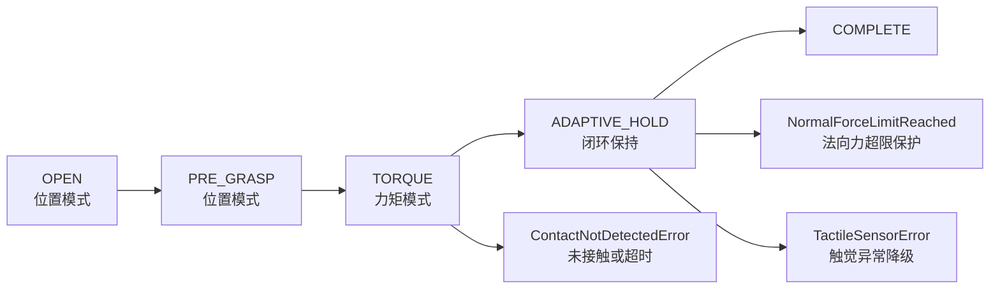
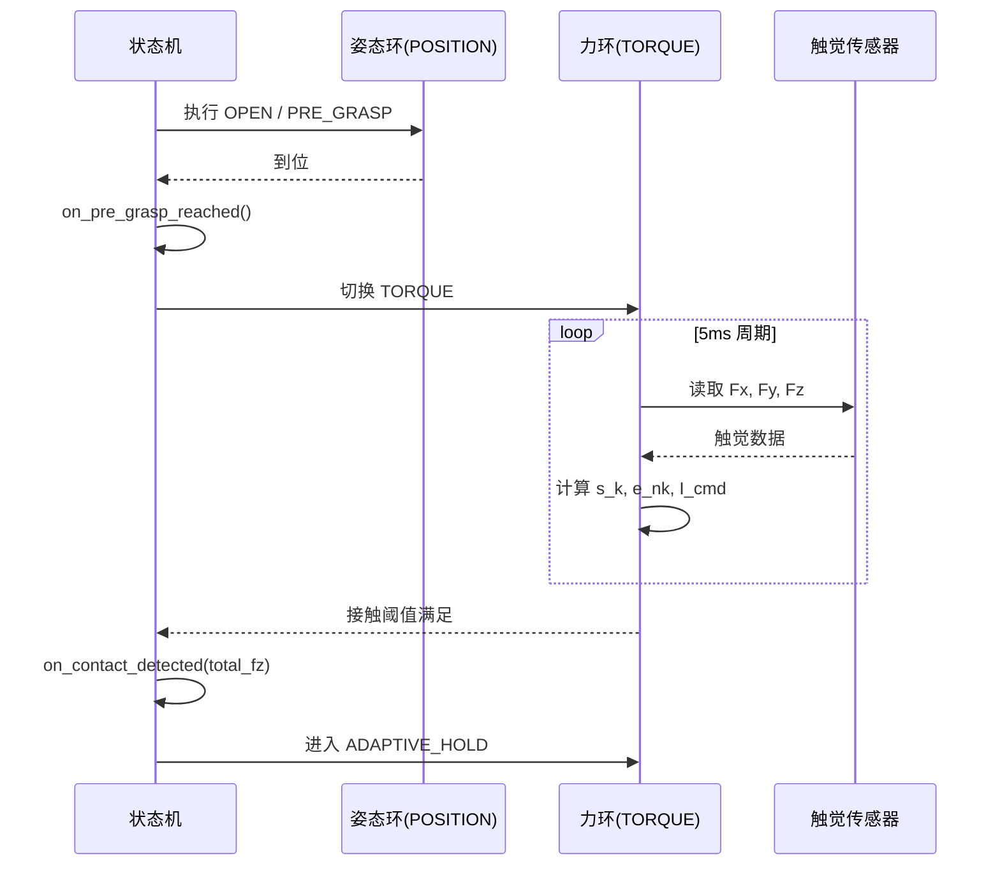
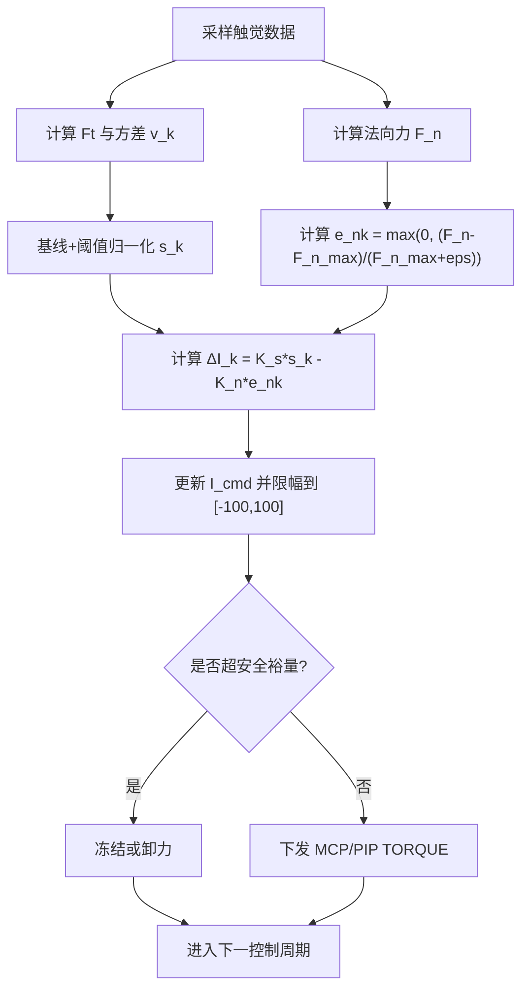

# 自适应抓取功能设计文档

**日期**: 2025-04-07  
**功能**: 基于触觉反馈的多阶段自适应抓取  
**方案**: 姿态-力解耦 + 回调驱动模式切换

---

## 1. 目标与范围

本设计用于实现可落地的闭环自适应抓取能力，核心目标如下：

1. 在不损伤物体的前提下实现稳定抓持。  
2. 在出现滑移趋势时自动增力，在法向力接近上限时自动保护。  
3. 用清晰状态机组织“位置模式 -> 力控模式”切换。  
4. 支持 `stiffness` 参数化，快速适配软硬不同物体。  

---

## 2. 关节约束与控制分工

### 2.1 主动自由度

- 食指/中指/无名指/小拇指：`MCP`、`PIP`。  
- 大拇指：`THUMB_ROTATION`、`THUMB_SWING`、`THUMB_MCP`、`THUMB_PIP`。  

### 2.2 被动自由度

- 全部 `DIP` 为被动自由度，不发送主动命令：  
  - `THUMB_DIP`  
  - `FF_DIP` / `MF_DIP` / `RF_DIP` / `LF_DIP`

### 2.3 姿态-力解耦策略

- 姿态环（低频，`POSITION`）：  
  - 主要保持几何关系，重点关节 `THUMB_ROTATION`、`THUMB_SWING`。  
- 力环（高频，`TORQUE`）：  
  - 仅作用于 `THUMB/FF/MF/RF/LF` 的 `MCP/PIP`，用于防滑与限力。  

---

## 3. 总体架构与状态机

状态机分四阶段：

1. `OPEN`：张开手指（`POSITION`）  
2. `PRE_GRASP`：到预抓取姿态（`POSITION`）  
3. `TORQUE`：力控闭合直到接触（`TORQUE`）  
4. `ADAPTIVE_HOLD`：触觉闭环自适应保持（`TORQUE`）

数据闭环主路径：

`触觉采样 -> 滑窗统计 -> 滑移风险估计 -> 电流指令更新 -> TORQUE 命令下发`

---

## 4. 回调驱动的模式切换

### 4.1 回调接口

```python
class AdaptiveGrasper:
    def on_pre_grasp_reached(self) -> None:
        """PRE_GRASP 到位后，切换到 TORQUE 模式"""

    def on_contact_detected(self, total_fz: float) -> None:
        """检测到接触后，进入 ADAPTIVE_HOLD"""

    def on_force_limit_reached(self, finger_id, fz: float) -> None:
        """法向力超限事件，触发保护策略"""
```

### 4.2 切换条件

1. `OPEN -> PRE_GRASP`：位置到位。  
2. `PRE_GRASP -> TORQUE`：触发 `on_pre_grasp_reached()`。  
3. `TORQUE -> ADAPTIVE_HOLD`：接触阈值满足，触发 `on_contact_detected(total_fz)`。  
4. `ADAPTIVE_HOLD`：若单指法向力超限，触发 `on_force_limit_reached()` 并抑制增力。  

---

## 5. 滑移风险估计（强制要求）

### 5.1 切向力与方差

\[
F_t=\sqrt{F_x^2+F_y^2}
\]

对每个手指维护滑动窗口（建议 10 样本）并计算当前方差 \(v_k\)。

### 5.2 归一化要求（必须）

滑移风险 \(s_k\) **必须**采用“基线+阈值归一化”：

\[
s_k=\mathrm{clip}\left(\frac{v_k-v_0}{v_{th}-v_0+\varepsilon},\,0,\,1\right)
\]

其中：

- \(v_0\)：无滑移基线方差  
- \(v_{th}\)：滑移判定方差阈值  
- \(\varepsilon\)：防止除零的小常数（建议 \(10^{-6}\)）

工程约束：

- \(v_{th}>v_0\)  
- `clip` 必须裁剪到 `[0,1]`

---

## 6. 力闭环控制律

### 6.1 基础闭环

\[
\Delta I_k = K_s s_k - K_n e_{n,k}
\]

\[
e_{n,k}=\max\left(0,\frac{F_{n,k}-F_{n,\max}}{F_{n,\max}+\varepsilon}\right)
\]

其中 \(\Delta I_k\) 为当前控制周期电流增量，\(s_k\in[0,1]\)。

### 6.2 符号定义

- \(k\)：离散控制步索引  
- \(s_k\)：滑移风险归一化信号  
- \(F_{n,k}\)：当前法向力（normal force）  
- \(F_{n,\max}\)：法向力安全上限  
- \(e_{n,k}\)：法向力超限误差  
- \(K_s\)：滑移反馈增益  
- \(K_n\)：超限惩罚增益  
- \(\Delta I_k\)：电流增量控制量

---

## 7. TORQUE/电流映射（硬件约束）

### 7.1 硬件能力

硬件支持有符号电流命令：

\[
I_{cmd}\in[-100,100]
\]

符号约定：

- \(I_{cmd}>0\)：闭合增力  
- \(I_{cmd}<0\)：张开减力  
- \(I_{cmd}=0\)：保持

### 7.2 映射公式（必须）

将第 6 节得到的电流增量直接积分到电流命令，并做场景限幅：

\[
I_{raw,k+1}=\mathrm{clip}\left(I_{cmd,k}+\Delta I_k,\, -I_{open,max},\, I_{close,max}\right)
\]

最后执行硬件总限幅：

\[
I_{cmd,k+1}=\mathrm{clip}(I_{raw,k+1},-100,100)
\]

### 7.3 速率限制（建议）

为防抖振，加入每周期变化限制：

\[
I_{cmd,k+1}=\mathrm{clip}\left(I_{cmd,k+1},\ I_{cmd,k}-\Delta_{down},\ I_{cmd,k}+\Delta_{up}\right)
\]

建议：

- `Δup` 小于等于 `Δdown`（先保守增力）  
- `ADAPTIVE_HOLD` 允许小幅负值用于卸力  

---

## 8. 参数设计建议

### 8.1 `stiffness` 映射

`stiffness ∈ [0,1]` 表示物体软硬程度：

- 0.0：极软，保护优先  
- 1.0：极硬，防滑优先

建议映射：

\[
F_{n,\max}=0.1+2.9\cdot stiffness
\]
\[
v_{th}=0.05+0.15\cdot stiffness
\]

### 8.2 初值建议

- `control_period_s = 0.005`  
- `sliding_window_size = 10`  
- `I_close_max = 25~35`（纸杯场景）  
- `I_open_max = 10~20`  
- `K_s`、`K_n` 先取小值并实测整定  
- `Δup`、`Δdown` 作为电流变化率限制参数

---

## 9. 与 `examples/20.torque_control.py` 的关系

`examples/20.torque_control.py` 是基础力矩接口演示。  
本方案在其基础上补充：

1. 姿态环与力环解耦  
2. 回调驱动模式切换  
3. 基线+阈值归一化  
4. `[-100,100]` 有符号电流映射与速率限制

---

## 10. 测试策略

### 10.1 单元测试

- 方差与归一化计算正确性  
- `ΔI_k` 更新与限幅逻辑  
- `I_cmd` 映射、符号约定、速率限制  
- 超限惩罚项生效逻辑  
- 回调触发与状态迁移

### 10.2 集成测试

- 四阶段流程完整走通  
- 不同 `stiffness` 场景稳定性  
- 扰动下防滑与保护平衡

### 10.3 边界测试

- 触觉丢包/异常值  
- 高噪声抖振  
- 长时间保持阶段稳定性

---

## 11. 评审答辩流程图

### 11.1 总体状态机



### 11.2 回调切换时序



### 11.3 闭环决策


