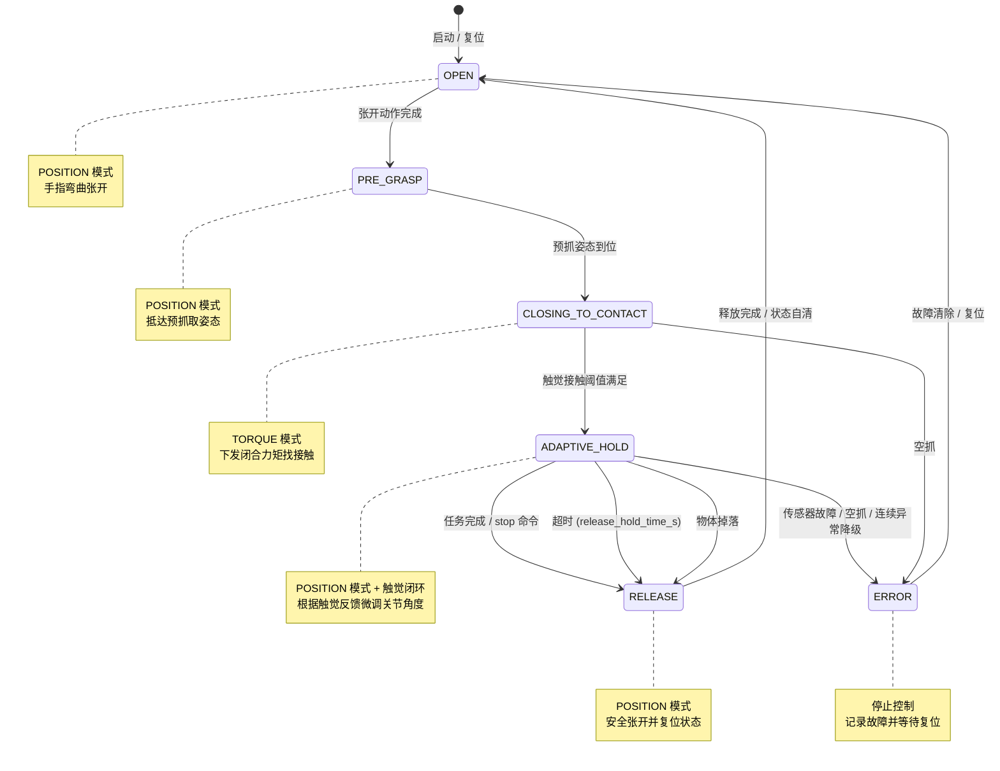

# 自适应抓取功能设计文档

**日期**: 2026-04-22
**功能**: 基于触觉反馈的多阶段自适应抓取
**方案**: 接触前力控闭合 + 接触后位置模式触觉闭环自适应保持

---

## 1. 目标与范围

1. **稳定抓持**: 在不损伤物体前提下实现稳定抓持。
2. **动态增稳**: 在滑移趋势出现时自动增稳，在法向力超限时自动卸力。
3. **硬件兼容**: 兼容当前硬件限制（同一时刻全手统一模式，力控模式未下发关节默认电流问题）。
4. **参数可扩展**: 支持不同抓取姿态下的参数调度与材质修正。

### 1.1 指标量化

根据需求文档，系统需满足以下量化指标：

| 指标项 | 目标值 | 说明 |
|:---|:---|:---|
| 触觉传感器法向力量程Fz | 0N ~ 25 N | 帕西尼0N ~ 25 N|
| 触觉传感器切向力量程Fxy（帕西尼）| ±10N| 帕西尼±10N|
| 最小识别力（力分辨率）|0.1N| 帕西尼0.1N|
| 空间分辨率|1mm|帕西尼1mm|
| 触觉反馈响应时间 | < 13ms | 帕西尼触觉传感器刷新率 83.3 Hz |
| 控制周期| ≤50ms|自适应保持阶段，闭环控制周期|
| 接触时间 | < 200ms | 从预抓取姿态到有效接触 |
| 抓取成功率 | ≥ 0.99 | 抓取成功率需在标准测试工况下（室温、无外力扰动、正常传感器标定状态）验证。 |


---

## 2. 控制架构与模块划分

系统仅使用两种底层控制模式：

- **POSITION（位置模式）**: 用于张开、预抓取、以及接触后的自适应保持阶段。
- **TORQUE（力矩模式）**: 用于闭合找接触阶段。


### 2.1 模块化架构

每个模块只负责一个独立领域，通过纯数据结构传递结果：

| 模块 | 文件 | 核心职责 |
|:---|:---|:---|
| **状态机主控** | `controller.py` | 阶段调度（OPEN → PRE_GRASP → CLOSING_TO_CONTACT → ADAPTIVE_HOLD → RELEASE）、命令下发、协调子模块 |
| **触觉分析器** | `tactile.py` | 滑动窗口管理、三指标滑移风险融合（切向力方差、空间一致性方向距离、摩擦利用率）、滑移风险归一化、防抖计数器 `slip_count` |
| **力规划器** | `force_planner.py` | 物体参数库 `ObjectProfile`、初始夹持力 `F_init` 计算与校准、前馈+PID 复合控制律（滑移前馈与法向力 PID 校正）、损伤防护模式限幅 |
| **安全监控器** | `safety.py` | 传感器故障检测、物体掉落检测、灵巧手空抓检测、异常降级决策、超时释放保护 |

各子模块不直接持有 `DexHand` 实例，只接收数据和配置并返回决策结果，确保单元测试时可以独立 mock。

---

## 3. 状态切换流程

### 3.1 关键切换条件

- `OPEN → PRE_GRASP`: 张开动作完成。
- `PRE_GRASP → CLOSING_TO_CONTACT`: 预抓姿态到位。
- `CLOSING_TO_CONTACT → ADAPTIVE_HOLD`: 触觉接触阈值满足（检测到有效接触）。
- `ADAPTIVE_HOLD → RELEASE`: 任务完成、外部停止命令、超时（默认 20s）或异常触发降级，降级至`RELEASE`状态。

### 3.2 完整流程详述

1. 系统进入 `OPEN`，下发 POSITION 模式张开动作。
2. 张开完成后进入 `PRE_GRASP`，按预抓姿态下发 POSITION 指令。
3. 预抓姿态到位后，触发 `PRE_GRASP → CLOSING_TO_CONTACT`，**全手统一**切换为 TORQUE 模式。
4. 在 `CLOSING_TO_CONTACT` 中周期执行：下发闭合力矩、读取触觉数据、判断接触阈值。
5. 触觉满足接触条件后，触发 `CLOSING_TO_CONTACT → ADAPTIVE_HOLD`。
6. 进入 `ADAPTIVE_HOLD` 后，**全手统一**切回 POSITION 模式，按触觉闭环更新目标角度，并下发速度/电流上限作为安全约束。
7. 若 `ADAPTIVE_HOLD` 期间检测到法向力超限，前馈项中的法向力惩罚分量产生负向控制量，通过位置角增量减小来降低抓取力。
8. 若触觉异常、超时或连续超限，触发降级分支（进入 `RELEASE` 或 `ERROR`）。
9. 任务完成或外部停止命令触发后进入 `RELEASE`，执行安全张开并回到空闲态。
10. 默认保持时长达到 `release_hold_time_s`（默认 `20s`，可配置）后自动触发 `RELEASE`。
11. `RELEASE` 采用 POSITION 模式，直接下发张开姿态，默认参数 `speed=20`、`torque=50`。预留安全张开参数接口：`release_open_speed`、`release_open_torque`（默认分别为 `10`、`50`）。

---

## 4. 物体参数库与初始夹持力

为了区分不同的物体，物体参数库 `ObjectProfile` dataclass 和 `ObjectProfileRegistry`。

### 4.1 参数库结构

```python
@dataclass
class ObjectProfile:
    name: str           # 物体名称标识
    weight_kg: float    # 物体重量（kg）
    material: str       # 材质（metal/plastic/glass/fabric/tofu 等）
    safe_force_min: float   # 安全夹持力下限（N）
    safe_force_max: float   # 安全夹持力上限（N）
    friction_coeff: float   # 手指与物体间摩擦系数
    is_fragile: bool    # 是否为易损物体
```

### 4.2 初始夹持力计算

```
F_init = weight_kg * g * safety_factor + base_holding_force
F_init = clip(F_init, safe_force_min, safe_force_max)
```

其中：
- `g`：重力加速度，`9.8 m/s²`
- `safety_factor`：安全系数，可配置范围 `[1.2, 2.0]`，默认 `1.5`
- `base_holding_force`：基础夹持力（N），覆盖机构空载摩擦，默认 `1.5 N`

计算得到的 `F_init` 均摊到参与抓取的手指数，得到单指目标法向力 `F_n,ref`。

### 4.3 抓取力校准

**目的**：消除接触瞬间实际法向力与期望力 `F_init` 之间的偏差，使系统以接近目标力的状态进入 `ADAPTIVE_HOLD`，避免后续 POSITION 闭环因大初始误差而收敛缓慢。

**触发时机**：`CLOSING_TO_CONTACT` 阶段，当所有手指法向力之和 `F_sum >= contact_threshold_z` 时触发。

**控制模式**：校准全程仍在 **TORQUE** 模式下执行，利用力矩与电机电流的近似线性关系实现快速力调整。

**调整流程**：

1. 读取当前各指法向力，计算总和 `F_sum`。
2. 若 `|F_sum - F_init| <= 2 N`，无需调整，直接通过。
3. 若偏差超过 `2 N`，按以下规则进行力矩步进微调，最多执行 **2 个周期**：
   - 若 `F_sum < F_init`，则 `current_torque += torque_adjust_step`
   - 若 `F_sum > F_init`，则 `current_torque -= torque_adjust_step`
4. 每个微调周期下发更新后的力矩指令，等待一个控制周期后重新读取触觉数据并计算 `F_sum`。
5. 微调结束后再次检查：若 `|F_sum - F_init| <= 2 N`，判定通过；否则判定校准失败。

**易损保护**：若物体标记为 `is_fragile=True`，力矩步进量临时乘以 `fragile_step_reduction`（默认 `0.5`），降低调整幅度。

**判定标准**

- 初始夹持力落在物体预设安全范围 `[safe_force_min, safe_force_max]` 内。
- 抓取后 10 s 内物体无滑移、无明显变形（易损物体无破损）。

---

## 5. 符号定义

| 符号 | 含义 |
|:---|:---|
| `k` | 离散控制周期索引（第 `k` 次控制更新） |
| `u_k` | 总控制量，当前版本 `u_k = u_{ff,k} + u_{pid,k}` |
| `u_{ff,k}` | 前馈控制量（由风险与超限误差直接计算） |
| `u_{pid,k}` | PID 校正量（用于抑制稳态误差和动态偏差） |
| `s_k` | 滑移风险指标，归一化到 `[0,1]`，越大表示越可能滑移 |
| `e_{n,k}` | 法向超限误差，表示当前法向力超过上限的归一化程度 |
| `F_{n,k}` | 第 `k` 周期估计/测得的法向力 |
| `F_{n,ref}` | 期望法向力（由物体参数库计算得出） |
| `F_{n,max}` | 允许的法向力上限（安全阈值） |
| `F_x, F_y` | 触觉切向分力分量 |
| `F_t` | 切向合力幅值，`F_t = sqrt(F_x^2 + F_y^2)` |
| `v_k` | 滑动窗口内 `F_t` 的方差（切向力波动强度） |
| `v_0` | 方差基线（无明显滑移时的参考值） |
| `v_{th}` | 滑移判定方差阈值（工程上满足 `v_{th} > v_0`） |
| `K_s` | 滑移风险增益（slip gain），将滑移风险映射为收紧趋势 |
| `K_n` | 法向超限抑制增益（normal-force penalty gain），将法向超限映射为卸力趋势 |
| `Δθ_{MCP,k}`、`Δθ_{PIP,k}` | 第 `k` 周期 MCP/PIP 关节角增量 |
| `K_{MCP}, K_{PIP}` | MCP/PIP 关节角增量分配系数，满足 `K_{MCP} + K_{PIP} = 1` |
| `θ_{joint,k}` | 第 `k` 周期某关节角度；`θ_{joint,k+1}` 为下一周期目标角度 |
| `θ_{min}, θ_{max}` | 该关节的机械/安全角度边界 |
| `clip(·)` | 限幅函数，将输入裁剪到指定区间 |
| `e_k` | PID 误差，当前版本 `e_k = F_{n,ref} - F_{n,k}` |
| `I_k` | 误差积分项，`I_k = Σ e_k T_s`（带限幅/防积分饱和） |
| `T_s` | 控制周期 |
| `ε` | 小正数，防止分母为零并增强数值稳定性 |
| `cos_x_k` | 第 `k` 周期与 `k-1` 周期之间 切向力x方向 `Fx` 向量的余弦相似度 |
| `cos_y_k` | 第 `k` 周期与 `k-1` 周期之间 切向力y方向 `Fy` 向量的余弦相似度 |
| `d_k` | 力场方向一致性距离指标，`d_k ∈ [0,1]`，越大表示力场畸变越严重 |
| `s_{total,k}` | 综合滑移风险指标，`s_{total,k} = α*s_k + β*d_k + γ*r_k`，归一化到 `[0,1]` |
| `α` | 方差风险权重，默认 `0.5` |
| `β` | 方向一致性风险权重，默认 `0.3` |
| `γ` | 摩擦利用率风险权重，默认 `0.2`，满足 `α + β + γ = 1` |
| `μ_eff,k` | 第 `k` 周期的摩擦利用率，`μ_eff,k = F_t,k / (F_n,k + ε)` |
| `r_k` | 摩擦利用率风险指标，`r_k ∈ [0,1]`，越大表示越接近摩擦临界 |
| `μ_ref` | 参考摩擦系数，取自 `ObjectProfile.friction_coeff` |
| `slip_count` | 滑动风险判断计数器 |
| `max_slip_count` | 滑移防抖计数器阈值，默认 `3` |

---

## 6. 接触后的触觉闭环控制

`ADAPTIVE_HOLD` 阶段的核心控制逻辑为：**以触觉指标为反馈，计算出关节角增量，在位置模式下周期更新目标角度**。

### 6.1 滑移风险指标

#### 6.1.1 切向力与方差计算

```
F_t = sqrt(F_x^2 + F_y^2)
```

在滑动窗口中计算切向力 `F_t` 的方差 `v_k`。

#### 6.1.2 风险归一化

```
s_k = clip((v_k - v_0) / (v_th - v_0 + ε), 0, 1)
```

工程约束：

- `v_th > v_0`
- 结果严格限幅到 `[0, 1]`

**控制意义**：`s_k` 越接近 1，表明滑移风险越高，控制器应倾向于收紧手指；`s_k` 越接近 0，表明抓持稳定。

#### 6.1.3 空间一致性（方向一致性距离）

为弥补单一方差指标对**缓慢平稳滑移**的检测盲区，引入基于触觉阵列力场空间分布的方向一致性检测。

稳定抓持时，各阵列点的切向力空间分布模式（方向与相对大小）相对稳定；当存在滑动趋势，摩擦力属于静摩擦力，其切向力的方向和大小可能会出现改变，即前后帧的切向力向量存在不一致，因此通过对比前后帧切向力向量的余弦相似度。来判断是否存在滑动趋势。

**计算步骤**：

设第 `k` 周期所有触觉阵列点的切向力分量为高维向量：
- `Fx_k = [F_x1,k, F_x2,k, ..., F_xN,k]`
- `Fy_k = [F_y1,k, F_y2,k, ..., F_yN,k]`

分别计算相邻周期的余弦相似度：
```
cos_x_k = (Fx_k · Fx_{k-1}) / (||Fx_k|| * ||Fx_{k-1}|| + ε)
cos_y_k = (Fy_k · Fy_{k-1}) / (||Fy_k|| * ||Fy_{k-1}|| + ε)
```
若摩擦力稳定，则余弦相似度越接近1。余弦相似度的取值范围为`[-1,1]`。因此，将 `[cos_x_k, cos_y_k]` 视为二维平面上的点，计算其到稳定点 `[1, 1]` 的欧氏距离，并归一化到 `[0, 1]`：
```
d_k = sqrt((1 - cos_x_k)^2 + (1 - cos_y_k)^2) / sqrt(2)
```

**工程约束**：
- 结果严格限幅到 `[0, 1]`
- 第 `k=0` 周期无历史数据，`d_0 = 0`

**控制意义**：`d_k` 越接近 1，表明指尖分布力前后帧差别越大，滑移风险越高；`d_k` 越接近 0，表明指尖分布力稳定。

<!-- **与方差指标的互补性**：

| 指标 | 捕捉特征 | 敏感场景 | 盲区 |
|:---|:---|:---|:---|
| `s_k`（方差） | 各点切向力**幅值的时间抖动** | 高频微滑移、振动 | 缓慢平稳滑移（方差低，但力场已偏移） |
| `d_k`（方向一致性） | 切向力**空间分布的结构畸变** | 接触面转移、姿态旋转、缓慢滑移 | 各点同向同幅抖动（分布不变，仅幅值跳变） |

`d_k` 可与 `s_k` 加权融合为 `s_{total,k}`（见 6.1.5），使系统同时覆盖“抖动型”与“转向型”滑移。 -->

#### 6.1.4 摩擦利用率风险

为弥补统计指标（`s_k`、`d_k`）对**物理临界状态**的预判盲区，引入基于库仑摩擦模型的摩擦利用率检测。

滑移的物理本质是切向力 `F_t` 超过法向力 `F_n` 与摩擦系数 `μ` 的乘积。即使切向力分布稳定、无显著变化，只要 `F_t` 已接近或达到 `μ·F_n`，滑移风险即处于高位。该指标直接度量当前接触状态与摩擦临界的接近程度。

**计算步骤**：

第 `k` 周期，计算摩擦利用率：
```
μ_eff,k = F_t,k / (F_n,k + ε)
```

其中：
- `F_t,k = sqrt(F_x,k^2 + F_y,k^2)`：单指切向合力幅值
- `F_n,k`：单指法向力（由触觉传感器 `F_z` 或经标定后的法向估计值）

以物体参数库中的参考摩擦系数 `μ_ref`（`ObjectProfile.friction_coeff`）为基准，归一化风险指标：
```
r_k = clip(μ_eff,k / μ_ref, 0, 1)
```

**工程约束**：
- 结果严格限幅到 `[0, 1]`
- `μ_ref` 需由物体参数库提供，若缺失则取默认 `0.8` 并记录警告
- `F_n,k` 过小（如 `< 0.1 N`）时，`r_k` 可信度下降，应结合 `F_n,k` 幅值做置信度衰减

**控制意义**：`r_k` 越接近 1，表明当前切向力已越接近摩擦极限，滑移风险越高；`r_k` 越接近 0，表明摩擦余量充足。

**与统计指标的互补性**：

| 指标 | 捕捉特征 | 敏感场景 | 盲区 | 盲区由谁互补 |
|:---|:---|:---|:---|:---|
| `s_k`（方差） | 切向力**幅值的时间抖动** | 高频微滑移、振动 | 缓慢平稳滑移、摩擦临界但未抖动 | `d_k` 检测缓慢滑移；`r_k` 检测摩擦临界 |
| `d_k`（前后帧切向分布力相关度） | 切向分布力**空间分布的变化** | 接触面转移、姿态旋转、缓慢滑移 | 各点同向同幅滑动（分布不变，仅幅值跳变） | `s_k` 检测同幅抖动；`r_k` 检测物理临界 |
| `r_k`（摩擦利用率） | **物理临界接近度** | 静摩擦极限、重力分量增大 | 摩擦系数标定误差、法向力传感器噪声 | `s_k`、`d_k` 为纯统计指标，不依赖摩擦系数标定 |

三指标加权融合为 `s_{total,k}`（见 6.1.5），使系统同时覆盖“抖动型”“转向型”与“临界型”滑移。

#### 6.1.5 滑移趋势判定与防抖

需求要求滑移检测准确率 ≥ 95%，且滑移趋势出现后 ≤ 50 ms 内被检测到，并引入**多周期防抖机制**：

1. **单周期风险标记**：当 `s_{total,k} >= 0.5` 时，标记该周期存在潜在滑移风险。综合指标 `s_{total,k}` 由方差风险 `s_k`、方向一致性距离 `d_k`（见 6.1.3）与摩擦利用率风险 `r_k`（见 6.1.4）三指标加权融合得到：
   ```
   s_{total,k} = α * s_k + β * d_k + γ * r_k      # α + β + γ = 1, 默认 α = 0.5, β = 0.3, γ = 0.2
   ```
2. **防抖计数器 `slip_count`**：
   - 若当前周期标记为风险，则 `slip_count += 1`
   - 若当前周期无风险，则 `slip_count = max(0, slip_count - 1)`（衰减机制，避免噪声导致的频繁跳变）
3. **正式判定**：当 `slip_count >= max_slip_count`（默认 `max_slip_count=3`，对应 3 个连续控制周期）时，正式判定为存在滑移趋势，触发增稳策略。

### 6.2 单指闭环控制律

**前馈项**：

```
u_{ff,k} = K_s * s_{total,k} - K_n * e_{n,k}
```

其中综合滑移风险指标 `s_{total,k}` 由 6.1.5 计算，法向超限误差为：

```
e_{n,k} = max(0, (F_{n,k} - F_{n,max}) / (F_{n,max} + ε))
```

**PID 校正项**：以**法向力误差**（即期望法向力与实际法向力的偏差）为输入，生成控制量来消除稳态误差并抑制动态偏差

```
e_k = F_{n,ref} - F_{n,k}
I_k = clip(I_{k-1} + e_k * T_s, I_min, I_max)
derivative = (e_k - e_{k-1}) / T_s
u_{pid,k} = K_p * e_k + K_i * I_k + K_d * derivative
```

> 说明：`I_k` 是误差 `e_k` 的离散时间积分项，用于累积并消除稳态偏差，`I_k|_{k=0}=0`；通过 `clip` 限幅防止积分饱和。

**总控制量**：

```
u_k = u_{ff,k} + u_{pid,k}
```

### 6.3 双自由度角增量分配

总控制量 `u_k` 映射到每个手指的两个主动关节（MCP/PIP）：

```
Δθ_{MCP,k} = K_{MCP} * u_k
Δθ_{PIP,k} = K_{PIP} * u_k
```

分配系数约束：

```
K_{MCP} + K_{PIP} = 1
K_{MCP}, K_{PIP} ∈ [0, 1]
```

### 6.4 目标角更新

下一周期目标角度由当前角度叠加增量并经安全限幅后得到：

```
θ_{joint,k+1} = clip(θ_{joint,k} + Δθ_{joint,k}, θ_{min}, θ_{max})
```

同时在 POSITION 命令中设置 `speed`、`torque` 作为额外的上层约束，避免角度超限或速度/力矩过大。

### 6.5 补充说明

初始夹持力计算、抓取力校准与自适应保持看似都围绕"让实际力接近期望力"，但三者在职责上完全不同，彼此不可替代：

| 步骤（对应章节） | 控制模式 | 核心职责 | 若缺失的风险 |
|:---|:---|:---|:---|
| **初始夹持力计算**（见 4.2） | 无（开环预计算） | 基于物体物理参数给出期望力 `F_init` | 校准和闭环都没有目标参考值，无从下手 |
| **抓取力校准**（见 4.3） | **TORQUE** 模式 | 接触后 1~2 个周期内，利用力矩直接映射快速消除大偏差 | 直接进入 `ADAPTIVE_HOLD` 时，角增量限幅很小（`Δθ_max = 0.3°~0.5°`/周期），大初始偏差下 PID 收敛需数十个周期；期间物体可能已滑移或掉落 |
| **自适应保持**（见 6.1~6.4） | **POSITION** 模式 | 精细闭环抑制滑移趋势与稳态误差 | 无法承担大偏差快速收敛的任务，其设计目标是"保持"而非"追赶" |

**关键设计约束**：`ADAPTIVE_HOLD` 运行在 POSITION 模式下，控制量是关节角增量，法向力只能通过 "角度 → 接触几何 → 法向力" 的间接映射间接改变，响应慢且存在死区；而校准阶段仍在 TORQUE 模式下，力矩与电机输出电流近似成比例，可在 1~2 个周期内将法向力快速拉到目标区间。因此，**校准是 ADAPTIVE_HOLD 能够稳定工作的前置条件**，而非重复功能。

---

## 7. 损伤防护控制设计

需求要求针对易损物体（如豆腐、香蕉）具备损伤防护机制，避免夹持力过大导致物体破损或变形。

### 7.1 易损物体识别

- **参数库标记**：在预设物体参数库中增加 `is_fragile: bool` 字段，标记该物体是否为易损件。
- **运行时切换**：当用户通过配置指定物体参数（如 `object_profile`）且 `is_fragile=True` 时，系统自动切换至**损伤防护模式**。

### 7.2 夹持力限制

- 易损物体的最大夹持力不得超过预设安全阈值 `F_{n,max}`（如玻璃制品 ≤ 15 N）。
- 当任一手指法向力达到阈值的 90% 时，自动减缓夹持速度：
  - `CLOSING_TO_CONTACT` 阶段：力矩步进增量 `torque_adjust_step` 临时降低 50%
  - `ADAPTIVE_HOLD` 阶段：角增量限幅 `delta_theta_limit` 临时收紧为原值的 50%
- 达到阈值 100% 后，停止任何正向加压（控制量 `u_k` 强制截断为非正值，仅允许卸力或保持）。

### 7.3 关节动作限制

损伤防护模式下，灵巧手所有主动关节的动作速度统一降低 30%，避免动作过快产生冲击：
- `position_speed_limit` 临时修正为 `0.7 ×` 原值（向下取整）
- `release_open_speed` 不受此限制，释放阶段仍需保证安全张开效率

### 7.4 判定标准

- 易损物体抓取后无破损、无变形。
- 夹持力始终 ≤ 预设安全阈值 `F_{n,max}`。

---

## 8. 异常处理设计

需求要求针对抓取过程中的异常情况具备处理能力，避免设备损坏或任务失败。异常检测集中到 `safety.py`，由主控状态机统一响应。

### 8.1 传感器故障

- **检测条件**：力传感器或关节编码器数据异常，包括：
  - 数据突变（单个周期内变化量超过物理合理范围，如角度跳变 > 30°）
  - 无数据（连续 3 个周期获取失败或返回 `None`）
- **处理策略**：
  1. 立即停止当前抓取动作，调用 `hand.stop()`
  2. 状态机切换至 `ERROR`
  3. 记录故障信息（时间戳、异常类型、最后有效数据）
  4. 触发报警信号（由上层通过事件监听获取）

### 8.2 灵巧手空抓

- **检测条件**：当灵巧手闭合找接触时，灵巧手关节动作角度大于阈值且触觉传感器没有接触信号（所有手指法向力之和 < `contact_threshold_z`）
- **处理策略**：
  1. 自动松开手指，停止控制，手指张开
  2. 状态机切换至 `ERROR`
  3. 触发报警信号

### 8.3 物体掉落/丢失

- **检测条件**：前一周期所有手指法向力之和 ≥ `contact_threshold_z`，当前周期所有手指法向力之和 < `contact_threshold_z`
- **处理策略**：
  1. 自动停止抓取动作，手指张开，进入 `RELEASE` 流程
  2. 状态机切换至 `ERROR`
  3. 触发报警信号，记录故障信息

### 8.4 统一异常响应流程

所有异常检测由 `safety.py` 的 `SafetyMonitor.check(tactile_data, joint_feedback, state)` 返回 `SafetyStatus`：

| 状态 | 含义 | 主控行为 |
|:---|:---|:---|
| `OK` | 正常 | 继续当前阶段 |
| `WARN` | 轻微异常（如单次数据丢包） | 冻结当前周期控制量，保持姿态 |
| `FAULT` | 严重故障 | 立即进入 `ERROR` 或 `RELEASE` |

---

## 9. 安全与降级策略

| 策略 | 处理方式 |
|:---|:---|
| **法向力超限** | 前馈项 `-K_n * e_{n,k}` 产生负向控制量，通过位置角增量减小来自然卸力 |
| **PID 防饱和** | 对 `u_k`、`Δθ` 实施限幅；积分项带上下限 |
| **连续超限降级** | 连续异常触发降级：进入 `RELEASE` |
| **触觉数据异常** | 丢包、突变时冻结更新，并保持当前姿态 |
| **四重限幅** | 角度、角度增量、speed、torque 均需独立限幅 |
| **超时与紧急停止** | 保留超时检测与急停策略 |
| **安全张开** | `ADAPTIVE_HOLD` 达到 `release_hold_time_s`（默认 `20s`）后，自动进入 `RELEASE`，使用参数 `release_open_speed=10`、`release_open_torque=50`（可配置） |

---

## 10. RELEASE 阶段设计方案

### 10.1 设计目标

1. **保护电机**：避免电机长时间工作、电机温度过高，导致电机损坏。
2. **脱离接触**：手指以可控速度从物体表面安全脱离。
3. **状态自清**：释放完成后，控制器自动回到空闲态，积分项、辨识参数等全部复位。

### 10.2 触发条件

| 来源 | 说明 |
|:---|:---|
| **正常完成** | 任务端显式发送 `stop_grasp` 或 `release` 命令。 |
| **超时保护** | `ADAPTIVE_HOLD` 持续时间达到 `release_hold_time_s`（默认 `20s` ）。 |
| **降级退出** | 触觉异常次数达到阈值，或检测到急停信号。 |

### 10.3 控制模式与参数

- **模式**：统一使用 **POSITION** 模式
- **目标姿态**：直接下发预配置的**张开姿态**（与 `OPEN` 状态共用一套目标角度）
- **运动参数**：
  - `release_open_speed = 10`（默认）
  - `release_open_torque = 50`（默认）

> 以上参数均通过配置文件暴露接口，便于根据物体软硬或电机工况做后期调参。

### 10.4 执行流程

1. **模式切换**：若当前为 `TORQUE`，先统一切为 `POSITION`。
2. **下发张开指令**：全手各主动关节按张开姿态目标角度、以及 `release_open_speed` / `release_open_torque` 下发 POSITION 命令。
3. **到位检测**：周期读取关节反馈，当所有主动关节与目标角度误差小于阈值（`theta_err_th = 2°`，可配置）且持续 `N` 个周期（`release_check_cycles = 5`）时，判定释放完成。
4. **状态复位**：积分项 `I_k` 清零；状态机回到 `OPEN`。

### 10.5 安全与异常处理

| 场景 | 处理策略 |
|:---|:---|
| **释放过程中触觉仍异常** | 不再依赖触觉，仅按预设张开轨迹执行；若电机报警则降速继续。 |
| **关节到位超时** | 设置 `release_timeout_s`（默认 `3` s），超时后强制停止并上报错误。 |
| **电机过流/过温** | 立即将该手指力矩上限临时下调 50%，持续张开；若仍报警则停机保护。 |


---

## 11. 参数可配置设计

需求要求算法关键参数支持手动配置、修改，适配不同场景与物体，无需修改算法代码。

### 11.1 可配置参数清单

| 参数类别 | 参数名 | 配置方式 | 说明 |
|:---|:---|:---|:---|
| 安全策略 | `safety_factor` | `AdaptiveGraspConfig` | 安全系数 `S_f`，范围 `[1.2, 2.0]`，默认 `1.5` |
| 安全策略 | `base_holding_force` | `AdaptiveGraspConfig` | 基础夹持力 `F_base`（N），默认 `0.5` |
| 滑移检测 | `slip_detect_debounce_cycles` | `AdaptiveGraspConfig` | 滑移防抖计数器阈值 `max_slip_count`，默认 `3` |
| 滑移检测 | `variance_threshold` | `AdaptiveGraspConfig` | 滑移判定方差阈值 `v_th`；为空时由 `stiffness` 估计 |
| 滑移检测 | `variance_weight` | `AdaptiveGraspConfig` | 方差风险融合权重 `α`，默认 `0.5` |
| 滑移检测 | `direction_weight` | `AdaptiveGraspConfig` | 方向一致性风险融合权重 `β`，默认 `0.3` |
| 滑移检测 | `friction_weight` | `AdaptiveGraspConfig` | 摩擦利用率风险融合权重 `γ`，默认 `0.2`，满足 `α + β + γ = 1` |
| 滑移检测 | `default_friction_coeff` | `AdaptiveGraspConfig` | 默认摩擦系数 `μ_ref`，当物体参数库未提供时 fallback，默认 `0.5` |
| 力控制 | `max_normal_force_per_finger` | `AdaptiveGraspConfig` | 单指法向力安全上限 `F_{n,max}`（N）；为空时由 `stiffness` 估计 |
| 损伤防护 | `fragile_speed_reduction` | `AdaptiveGraspConfig` | 易损模式速度降低比例，默认 `0.7` |
| 损伤防护 | `fragile_step_reduction` | `AdaptiveGraspConfig` | 易损模式角增量/力矩步进降低比例，默认 `0.5` |
| RELEASE | `release_hold_time_s` | `AdaptiveGraspConfig` | 保持阶段超时（s） |
| RELEASE | `release_open_speed` / `release_open_torque` | `AdaptiveGraspConfig` | 安全张开速度与力矩 |
| PID | `K_p` / `K_i` / `K_d` | `AdaptiveGraspConfig` | PID 增益 |
| 前馈 | `K_s` / `K_n` | `AdaptiveGraspConfig` | 滑移/法向超限前馈增益 |

### 11.2 配置生效时机

- 静态参数（如 `safety_factor`、`release_hold_time_s`）在 `AdaptiveGraspConfig` 初始化时校验并生效。
- 动态参数（如 `max_normal_force_per_finger`、`K_p`）在 `ADAPTIVE_HOLD` 阶段每个控制周期重新读取，支持运行时不停止抓取即调参。

---

## 12. 参数初值建议

下表汇总了系统实现前必须预先给定或标定的全部参数。带 **√** 的项已给出工程默认值或建议范围；带 **—** 的项需在具体硬件与场景下标定，但必须在部署前确定。

| 参数名 | 符号 | 预定义值 / 建议范围 | 备注 |
|:---|:---|:---|:---|
| `release_hold_time_s` | — | **√** `20` s | `ADAPTIVE_HOLD` 超时后自动触发 `RELEASE` |
| `release_open_speed` | — | **√** `10` | `RELEASE` 阶段安全张开速度 |
| `release_open_torque` | — | **√** `50` | `RELEASE` 阶段安全张开的力矩上限 |
| `release_timeout_s` | — | **√** `3` s | `RELEASE` 阶段关节到位超时保护 |
| `theta_err_th` | — | **√** `2°` | 释放到位角度误差阈值 |
| `release_check_cycles` | `N` | **√** `5` | 到位判定需持续的周期数 |
| `control_period_s` | `T_s` | **√** `0.005` s | 离散控制周期 |
| `sliding_window_size` | — | **√** `10` | 切向力方差滑动窗口长度（周期数） |
| `delta_theta_limit` | `Δθ_max` | **√** `0.3° ~ 0.5°`/周期 | 单周期最大关节角增量 |
| `position_speed_limit` | — | **√** `10 ~ 20` | POSITION 模式下速度上限约束 |
| `position_torque_limit` | — | **√** `20 ~ 35` | POSITION 模式下力矩上限约束（软物体取低值） |
| `s_ref` | `s_ref` | **√** `0.2 ~ 0.3` | 目标滑移风险水平（保留但不用于 PID 误差） |
| `variance_weight` | `α` | **√** `0.5` | 方差风险 `s_k` 的融合权重 |
| `direction_weight` | `β` | **√** `0.3` | 方向一致性距离 `d_k` 的融合权重 |
| `friction_weight` | `γ` | **√** `0.2` | 摩擦利用率风险 `r_k` 的融合权重，满足 `α + β + γ = 1` |
| `default_friction_coeff` | `μ_ref` | **√** `0.5` | 物体参数库未提供时的默认摩擦系数 |
| `K_s` | `K_s` | **—** 需标定 | 滑移风险增益 |
| `K_n` | `K_n` | **—** 需标定 | 法向超限抑制增益 |
| `K_p` | `K_p` | **—** 需调参 | PID 比例增益 |
| `K_i` | `K_i` | **—** 需调参 | PID 积分增益 |
| `K_d` | `K_d` | **—** 需调参 | PID 微分增益 |
| `I_min` / `I_max` | — | **—** 需调参 | 积分项限幅边界（防积分饱和） |
| `K_MCP` | `K_MCP` | **√** `0.5` | 未标定时默认值；建议按姿态建表 |
| `K_PIP` | `K_PIP` | **√** `0.5` | 未标定时默认值；满足 `K_MCP + K_PIP = 1` |
| `epsilon` | `ε` | **√** 小正数（如 `1e-6`） | 防止分母为零，增强数值稳定性 |
| `v_0` | `v_0` | **—** 需标定 | 无明显滑移时的方差基线 |
| `v_th` | `v_th` | **—** 需标定 | 滑移判定方差阈值，必须满足 `v_th > v_0` |
| `safety_factor` | `S_f` | **√** `1.5` | 安全系数，范围 `[1.2, 2.0]` |
| `base_holding_force` | `F_base` | **√** `0.5 N` | 基础夹持力 |
| `slip_detect_debounce_cycles` | `max_slip_count` | **√** `3` | 滑移防抖连续周期阈值 |
| `fragile_speed_reduction` | — | **√** `0.7` | 易损模式速度降低比例 |
| `fragile_step_reduction` | — | **√** `0.5` | 易损模式角增量/力矩步进降低比例 |

---

## 13. 状态转移图


