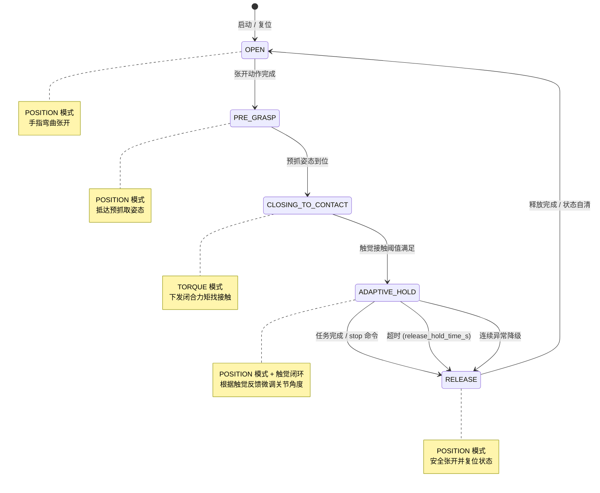

# 自适应抓取功能设计文档

**日期**: 2026-04-08  
**功能**: 基于触觉反馈的多阶段自适应抓取  
**方案**: 接触前力控闭合 + 接触后位置模式触觉闭环自适应保持
 
---

## 1. 目标与范围

1. **稳定抓持**: 在不损伤物体前提下实现稳定抓持。  
2. **动态增稳**: 在滑移趋势出现时自动增稳，在法向力超限时自动卸力。  
3. **硬件兼容**: 兼容当前硬件限制（同一时刻全手统一模式，力控模式未下发关节默认电流问题）。  
4. **参数可扩展**: 支持不同抓取姿态下的参数调度与材质修正。

### 1.1 指标量化

根据需求文档，系统需满足以下量化指标：

| 指标项 | 目标值 | 说明 |
|:---|:---|:---|
| 单手指抓取法向力量程 | 0.5 N ~ 15 N | 覆盖从易损柔性件到金属块的夹持力范围 |
| 触觉反馈响应时间 | < 0.2 s | 触觉传感器刷新率 83.3 Hz，控制周期 5 ms ~ 10 ms |
| 接触时间 | < 1 s | 从预抓取姿态到检测到有效接触 |
| 抓取成功率 | ≥ 0.8 | 抓取成功率需在标准测试工况下（室温、无外力扰动、正常传感器标定状态）验证。 |

> 注：成功率指标需在标准测试工况下（室温、无外力扰动、正常传感器标定状态）验证。

---

## 2. 控制架构概览

### 2.1 控制模式分工

系统仅使用两种底层控制模式：

- **POSITION（位置模式）**: 用于张开、预抓取、以及接触后的自适应保持阶段。  
- **TORQUE（力矩模式）**: 仅用于闭合找接触阶段。

### 2.2 核心状态机

系统共包含 5 个离散状态：

1. **`OPEN`**（POSITION）：手指弯曲张开，电机处于位置模式。
2. **`PRE_GRASP`**（POSITION）：预抓取状态，手指关节抵达预先设定的预抓取姿态。
3. **`CLOSING_TO_CONTACT`**（TORQUE）：闭合关节，直到触觉传感器检测到接触物体。
4. **`ADAPTIVE_HOLD`**（POSITION + 触觉闭环）：自适应保持阶段，在保持物体接触的同时，根据触觉反馈微调关节角度。
5. **`RELEASE`**：释放物体并保护电机，执行安全张开后回到空闲态。

---

## 3. 状态切换流程

### 3.1 关键切换条件

- `OPEN → PRE_GRASP`: 张开动作完成。
- `PRE_GRASP → CLOSING_TO_CONTACT`: 预抓姿态到位。
- `CLOSING_TO_CONTACT → ADAPTIVE_HOLD`: 触觉接触阈值满足（检测到有效接触）。
- `ADAPTIVE_HOLD → RELEASE`: 任务完成、外部停止命令、超时（默认 20s）或连续异常触发降级。

### 3.2 完整流程详述

1. 系统进入 `OPEN`，下发 POSITION 模式张开动作。  
2. 张开完成后进入 `PRE_GRASP`，按预抓姿态下发 POSITION 指令。  
3. 预抓姿态到位后，触发 `PRE_GRASP → CLOSING_TO_CONTACT`，**全手统一**切换为 TORQUE 模式。  
4. 在 `CLOSING_TO_CONTACT` 中周期执行：下发闭合力矩、读取触觉数据、判断接触阈值。  
5. 触觉满足接触条件后，触发 `CLOSING_TO_CONTACT → ADAPTIVE_HOLD`。  
6. 进入 `ADAPTIVE_HOLD` 后，**全手统一**切回 POSITION 模式，按触觉闭环更新目标角度，并下发速度/电流上限作为安全约束。  
7. 若 `ADAPTIVE_HOLD` 期间检测到法向力超限，优先执行卸力分支，并保持在当前状态继续评估。  
8. 若触觉异常、超时或连续超限，触发降级分支（固定保守参数或退出保持）。  
9. 任务完成或外部停止命令触发后进入 `RELEASE`，执行安全张开并回到空闲态。  
10. 默认保持时长达到 `release_hold_time_s`（默认 `20s`，可配置）后自动触发 `RELEASE`。  
11. `RELEASE` 采用 POSITION 模式，直接下发张开姿态，默认参数 `speed=20`、`torque=50`。预留安全张开参数接口：`release_open_speed`、`release_open_torque`（默认分别为 `10`、`50`）。

### 3.3 预设物体参数库与初始夹持力计算

需求要求算法根据物体重量、材质自动计算最优初始夹持力，并支持预设参数库扩展。

**参数库结构**

| 字段 | 类型 | 说明 |
|:---|:---|:---|
| `object_name` | `str` | 物体名称标识 |
| `material` | `str` | 材质（metal/plastic/glass/fabric/tofu 等） |
| `weight_kg` | `float` | 物体重量（kg） |
| `safe_force_min` | `float` | 安全夹持力下限（N） |
| `safe_force_max` | `float` | 安全夹持力上限（N），易损物体通常 ≤ 15 N |
| `friction_coeff` | `float` | 手指与物体间摩擦系数（用于滑移判定） |
| `is_fragile` | `bool` | 是否为易损物体 |

**初始夹持力计算**

$F_{init} = m g S_f + F_{base}$

其中：
- $W$：物体重量（kg）
- $g$：重力加速度（$9.8\,\text{m/s}^2$）
- $S_f$：安全系数，可配置范围 $[1.2,\ 2.0]$，默认 `1.5`
- $F_{base}$：基础夹持力（N），覆盖机构空载摩擦，默认 `0.5 N`

计算得到的 $F_{init}$ 需经限幅处理：

$$
F_{init} = \mathrm{clip}(F_{init},\ F_{safe,min},\ F_{safe,max})
$$

**夹持力校准**

在 `CLOSING_TO_CONTACT` 阶段检测到接触后，读取各手指法向力并求和 $F_{sum}$。若 $|F_{sum} - F_{init}| > 5\,\text{N}$，则在进入 `ADAPTIVE_HOLD` 前通过 1~2 个周期的力矩微调，将总法向力修正至 $F_{init} \pm 2\,\text{N}$ 范围内。

**判定标准**

- 初始夹持力落在物体预设安全范围 $[F_{safe,min},\ F_{safe,max}]$ 内。
- 抓取后 10 s 内物体无滑移、无明显变形（易损物体无破损）。

---

## 4. 符号定义

为避免后续公式中的歧义，符号统一定义如下：

| 符号 | 含义 |
|:---|:---|
| $k$ | 离散控制周期索引（第 $k$ 次控制更新） |
| $u_k$ | 总控制量，$u_k = u_{ff,k} + u_{pid,k}$ |
| $u_{ff,k}$ | 前馈控制量（由风险与超限误差直接计算） |
| $u_{pid,k}$ | PID 校正量（用于抑制稳态误差和动态偏差） |
| $s_k$ | 滑移风险指标，归一化到 $[0,1]$，越大表示越可能滑移 |
| $e_{n,k}$ | 法向超限误差，表示当前法向力超过上限的归一化程度 |
| $F_{n,k}$ | 第 $k$ 周期估计/测得的法向力 |
| $F_{n,\max}$ | 允许的法向力上限（安全阈值） |
| $F_x, F_y$ | 触觉切向分力分量 |
| $F_t$ | 切向合力幅值，$F_t = \sqrt{F_x^2 + F_y^2}$ |
| $v_k$ | 滑动窗口内 $F_t$ 的方差（切向力波动强度） |
| $v_0$ | 方差基线（无明显滑移时的参考值） |
| $v_{th}$ | 滑移判定方差阈值（工程上满足 $v_{th} > v_0$） |
| $F_{n,ref}$ | 期望法向力 |
| $K_s$ | 滑移风险增益（slip gain），将滑移风险映射为收紧趋势 |
| $K_n$ | 法向超限抑制增益（normal-force penalty gain），将法向超限映射为卸力趋势 |
| $\Delta \theta_{MCP,k}$、$\Delta \theta_{PIP,k}$ | 第 $k$ 周期 MCP/PIP 关节角增量 |
| $K_{MCP}, K_{PIP}$ | MCP/PIP 关节角增量分配系数，满足 $K_{MCP} + K_{PIP} = 1$ |
| $K_{MCP,0}$ | 由抓取姿态先验给出的 MCP 分配基值 |
| $\Delta K_m$ | 由材质（软硬、光滑度）引入的小幅修正项 |
| $K_{\min}, K_{\max}$ | 分配系数允许范围的上下界 |
| $\theta_{joint,k}$ | 第 $k$ 周期某关节角度；$\theta_{joint,k+1}$ 为下一周期目标角度 |
| $\theta_{\min}, \theta_{\max}$ | 该关节的机械/安全角度边界 |
| $\mathrm{clip}(\cdot)$ | 限幅函数，将输入裁剪到指定区间 |
| $e_k$ | PID 误差，$e_k = s_{ref} - s_k$ |
| $I_k$ | 误差积分项，$I_k = \sum e_k T_s$（由 $e_k$ 离散时间积分得到，带限幅/防积分饱和） |
| $T_s$ | 控制周期 |
| $\epsilon$ | 小正数，防止分母为零并增强数值稳定性 |

---

## 5. 接触后 POSITION 触觉闭环

`ADAPTIVE_HOLD` 阶段的核心控制逻辑为：**以触觉指标为反馈，计算出关节角增量，在位置模式下周期更新目标角度**。

### 5.1 滑移风险指标

#### 5.1.1 切向力与方差计算

\[
F_t = \sqrt{F_x^2 + F_y^2}
\]

在滑动窗口中计算切向力 $F_t$ 的方差 $v_k$。

#### 5.1.2 风险归一化

\[
s_k = \mathrm{clip}\left(\frac{v_k - v_0}{v_{th} - v_0 + \epsilon},\ 0,\ 1\right)
\]

工程约束：

- $v_{th} > v_0$
- 结果严格限幅到 $[0, 1]$

**控制意义**：$s_k$ 越接近 1，表明滑移风险越高，控制器应倾向于收紧手指；$s_k$ 越接近 0，表明抓持稳定。

#### 5.1.3 滑移趋势判定与防抖

需求要求滑移检测准确率 ≥ 95%，且滑移趋势出现后 ≤ 50 ms 内被检测到。为实现此目标，引入**多周期防抖机制**：

1. **单周期风险标记**：当 $s_k \geq 0.5$（即 $v_k$ 超过基线与阈值的中点）时，标记该周期存在潜在滑移风险。
2. **防抖计数器**：维护连续风险周期计数器 $c_k$：
   - 若当前周期标记为风险，则 $c_k = c_{k-1} + 1$；
   - 若当前周期无风险，则 $c_k = \max(0,\ c_{k-1} - 1)$（衰减机制，避免噪声导致的频繁跳变）。
3. **正式判定**：当 $c_k \geq C_{th}$（默认 $C_{th}=3$，对应 3 个连续控制周期，约 15~30 ms）时，正式判定为存在滑移趋势，触发增稳策略。
4. **漏判防护**：若 $s_k = 1.0$（即 $v_k \geq v_{th}$）且法向力 $F_{n,k}$ 同时出现明显下降（$\Delta F_n \leq -0.3\,F_{n,\max}$），则跳过防抖直接判定为滑移，确保极端情况响应时间 ≤ 50 ms。

> 检测频率：控制周期 $T_s = 0.005\,\text{s}$ ~ $0.01\,\text{s}$，对应实际检测频率 100 Hz ~ 200 Hz，满足需求 ≥ 60 Hz 的要求。

### 5.2 单指闭环控制律

定义前馈项与 PID 校正项：

**前馈项**：
\[
u_{ff,k} = K_s s_k - K_n e_{n,k}
\]

其中法向超限误差为：
\[
e_{n,k} = \max\left(0,\ \frac{F_{n,k} - F_{n,\max}}{F_{n,\max} + \epsilon}\right)
\]

**PID 校正项**：
\[
e_k = F_{n,ref} - F_{n,k},\quad
I_k = \mathrm{clip}(I_{k-1} + e_k T_s,\ I_{\min},\ I_{\max})
\]
\[
u_{pid,k} = K_p e_k + K_i I_k + K_d \frac{e_k - e_{k-1}}{T_s}
\]

> 说明：$I_k$ 是误差 $e_k$ 的离散时间积分项，用于累积并消除稳态偏差，$I_{k}|_{k=0}=0$；通过 $\mathrm{clip}$ 限幅防止积分饱和。

**总控制量**：
\[
u_k = u_{ff,k} + u_{pid,k}
\]

备注：为什么要引入PID控制？
1）$s_k$是用来表征手指与物体之间的微观切向运动程度，$s_k$越接近1，表明滑移风险越高，控制器应倾向于收紧手指；
2）$s_k=0$只说明当前没有检测到任何滑移现象，但这可能是因为：手指只是轻轻搭在物体上，法向力不足或触觉传感器还没充分受力。一旦收到轻微扰动，抓取的稳态可能会瞬间崩塌。通过引入PID控制，对法向力进行矫正。从而避免抓取的法向力不够的问题。
### 5.3 双自由度角增量分配

总控制量 $u_k$ 映射到每个手指的两个主动关节（MCP/PIP）：

\[
\Delta\theta_{MCP,k} = K_{MCP} \cdot u_k,\quad
\Delta\theta_{PIP,k} = K_{PIP} \cdot u_k
\]

分配系数约束：

\[
K_{MCP} + K_{PIP} = 1,\quad
K_{MCP},\ K_{PIP} \in [K_{\min},\ K_{\max}]
\]

### 5.4 目标角更新

下一周期目标角度由当前角度叠加增量并经安全限幅后得到：

\[
\theta_{joint,k+1} = \mathrm{clip}\left(\theta_{joint,k} + \Delta\theta_{joint,k},\ \theta_{\min},\ \theta_{\max}\right)
\]

同时在 POSITION 命令中设置 `speed`、`torque` 作为额外的上层约束，避免角度超限或速度/力矩过大。

### 5.5 卸力策略设计

需求要求法向力超限时 ≤ 50 ms 内启动卸力，卸力后夹持力稳定在安全范围内。设计文档将卸力分为**常规卸力**与**紧急卸力**两档：

**力阈值分级**

| 阈值 | 定义 | 触发条件 |
|:---|:---|:---|
| 安全阈值 $F_{n,\max}$ | 根据物体材质设定的单指最大法向力 | 法向力超过此值即视为超限 |
| 紧急卸力阈值 $F_{n,emg}$ | $1.2 \times F_{n,\max}$ | 法向力超过安全阈值的 120% 时触发 |

**常规卸力**

当 $F_{n,\max} < F_{n,k} \leq F_{n,emg}$ 时：
- 控制量 $u_k$ 中前馈项 $u_{ff,k}$ 的法向超限抑制分量 $-K_n e_{n,k}$ 占主导，产生负向（卸力）趋势。
- PID 积分项 $I_k$ 在法向超限时**冻结更新**（保持上一周期值），防止积分继续累积导致进一步加压。
- 角增量经限幅后缓慢降低目标角度，夹持力回落至安全阈值的 80%–90% 后保持稳定。

**紧急卸力**

当 $F_{n,k} > F_{n,emg}$ 时：
- 立即将下一周期总角增量强制设为负向最大值（$-\Delta\theta_{\max}$），全手同步卸力。
- 跳过 PID 计算，直接执行安全张开步进，直至 $F_{n,k} \leq F_{n,\max}$。
- 若连续 2 个周期仍无法回落至安全范围，触发降级：状态机退出 `ADAPTIVE_HOLD`，进入 `RELEASE`。

**卸力反馈**
- 卸力过程中实时记录法向力序列，卸力完成后发出 `force_relieved` 内部事件，供上层日志或报警使用。
- 若卸力后再次检测到超限，重复卸力流程；若 3 次重复卸力后仍超限，触发报警并进入 `RELEASE`。

---

## 6. 姿态主导的参数策略

### 6.1 基本原则

`K_MCP / K_PIP` 的取值应**主要由抓取姿态决定**，物体的软硬/光滑程度仅做小幅修正：

\[
K_{MCP} = K_{MCP,0} + \Delta K_m,\quad
K_{PIP} = 1 - K_{MCP}
\]

其中 $\Delta K_m$ 建议限幅在 $\pm 0.1$ 以内，避免参数大幅跳变。

### 6.2 默认起步值

- **未标定时**：`K_MCP = 0.5`，`K_PIP = 0.5`（均分策略）。
- **推荐做法**：先按抓取姿态建立参数表（如两指捏、三指捏、包络抓），再在同一姿态类别内根据物体材质做微调。

---

## 7. 损伤防护控制设计

需求要求针对易损物体（如玻璃、豆腐、陶瓷、柔性件）具备损伤防护机制，避免夹持力过大导致物体破损或变形。

### 7.1 易损物体识别

- **参数库标记**：在预设物体参数库中增加 `is_fragile: bool` 字段，标记该物体是否为易损件。
- **运行时切换**：当用户通过配置指定物体参数（如 `object_profile`）且 `is_fragile=True` 时，系统自动切换至**损伤防护模式**。
- **视觉传感器扩展（可选）**：预留视觉传感器识别接口，若接入视觉模块，可通过物体表面特征（反光、纹理、形状）辅助判断易损性，但当前版本以参数库标记为主。

### 7.2 夹持力限制

- 易损物体的最大夹持力不得超过预设安全阈值 $F_{n,\max}$（如玻璃制品 ≤ 15 N）。
- 当任一手指法向力达到阈值的 90% 时，自动减缓夹持速度：
  - `CLOSING_TO_CONTACT` 阶段：力矩步进增量 `torque_adjust_step` 临时降低 50%。
  - `ADAPTIVE_HOLD` 阶段：角增量限幅 `delta_theta_limit` 临时收紧为原值的 50%。
- 达到阈值 100% 后，停止任何正向加压，仅允许卸力或保持。

### 7.3 关节动作限制

损伤防护模式下，灵巧手所有主动关节的动作速度统一降低 30%，避免动作过快产生冲击：
- `position_speed_limit` 临时修正为 `0.7 \times` 原值（向下取整）。
- `release_open_speed` 不受此限制，释放阶段仍需保证安全张开效率。

### 7.4 判定标准

- 易损物体抓取后无破损、无变形。
- 夹持力始终 ≤ 预设安全阈值 $F_{n,\max}$。

---

## 8. 抓取姿态稳定控制设计

需求要求抓取过程中物体姿态保持稳定，倾斜角度 ≤ 5°、翻转角度 ≤ 5°。

### 8.1 控制策略

当前版本以**姿态预配置**为主，视觉闭环为辅：

1. **预抓取姿态校准**：在 `PRE_GRASP` 阶段，通过精确的预抓取姿态预设（`pre_grasp_pose`）确保手指对称包络物体，减少初始姿态偏差。
2. **对称增稳约束**：在 `ADAPTIVE_HOLD` 阶段，对侧手指（如食指与中指、无名指与小指）的角增量 $\Delta\theta$ 实施**镜像对称约束**，避免单侧收紧导致物体倾斜。
3. **视觉传感器接口（可选）**：预留 `set_target_orientation(target_roll, target_pitch)` 接口，若后续接入视觉传感器，可将视觉测得的物体姿态偏差映射为手指力分配调整，但当前版本不强制依赖视觉。

### 8.2 判定标准

- 抓取后人眼观测无明显倾斜、翻转。
- 若接入视觉传感器，测量物体姿态倾斜角度 ≤ 5°、翻转角度 ≤ 5°，持续保持稳定。

---

## 9. 异常处理设计

需求要求针对抓取过程中的异常情况具备处理能力，避免设备损坏或任务失败。

### 9.1 传感器故障

- **检测条件**：力传感器或关节编码器数据异常，包括：
  - 数据突变（单个周期内变化量超过物理合理范围，如角度跳变 > 30°）。
  - 无数据（连续 3 个周期获取失败或返回 `None`）。
- **处理策略**：
  1. 立即停止当前抓取动作，调用 `hand.stop()`。
  2. 状态机切换至 `ERROR`。
  3. 记录故障信息（时间戳、异常类型、最后有效数据）。
  4. 可选：触发报警信号（由上层通过事件监听获取）。

### 9.2 物体掉落

- **检测条件**：夹持力突然降至接近 0（所有手指法向力之和 < 0.2 N），且前一周期法向力正常（> 1 N）。
- **处理策略**：
  1. 自动松开手指，进入 `RELEASE` 流程，执行安全张开。
  2. 状态机切换至 `ERROR`。
  3. 触发报警信号，记录掉落事件。

### 9.3 力超限无法卸力

- **检测条件**：法向力超过紧急卸力阈值 $F_{n,emg}$，且连续 2 个周期执行紧急卸力后仍无法回落至安全范围。
- **处理策略**：
  1. 立即切断灵巧手动力（调用 `hand.stop()` 或下发零力矩指令）。
  2. 状态机切换至 `ERROR`。
  3. 触发报警信号，记录力超限事件与最后传感器读数。

---

## 10. 安全与降级策略

| 策略 | 处理方式 |
|:---|:---|
| **法向力超限** | 立即卸力（负向小步角度更新），并继续评估。 |
| **PID 防饱和** | 当法向超限或触觉异常时，冻结/回退积分项；并对 $u_k$、$\Delta\theta$ 实施限幅。 |
| **连续超限降级** | 连续超限触发降级：固定到保守参数或退出 `ADAPTIVE_HOLD`。 |
| **触觉数据异常** | 丢包、突变时冻结更新，并保持当前姿态。 |
| **四重限幅** | 角度、角增量、speed、torque 均需独立限幅。 |
| **超时与紧急停止** | 保留超时检测与急停策略。 |
| **安全张开** | `ADAPTIVE_HOLD` 达到 `release_hold_time_s`（默认 `20s`）后，自动进入 `RELEASE`，使用参数 `release_open_speed=10`、`release_open_torque=50`（可配置）。 |

---

## 12. RELEASE 阶段设计方案

文档前文仅将 `RELEASE` 作为状态机终点与安全策略的触发结果做概要说明。为确保工程落地，本节对释放阶段做专门设计。

### 12.1 设计目标

1. **保护电机与机械结构**：在释放物体时避免手指骤张或撞击限位。  
2. **快速脱离接触**：手指以可控速度从物体表面安全脱离。  
3. **状态自清**：释放完成后，控制器自动回到空闲态（`OPEN` 或外部定义的 `IDLE`），积分项、辨识参数等全部复位。

### 12.2 触发条件

| 来源 | 说明 |
|:---|:---|
| **正常完成** | 任务端显式发送 `stop_grasp` 或 `release` 命令。 |
| **超时保护** | `ADAPTIVE_HOLD` 持续时间达到 `release_hold_time_s`（默认 `20` s）。 |
| **降级退出** | 连续法向力超限、触觉异常次数达到阈值，或检测到急停信号。 |

### 12.3 控制模式与参数

- **模式**：统一使用 **POSITION** 模式（兼容硬件全手统一模式约束，且规避力控电流问题）。
- **目标姿态**：直接下发预配置的**张开姿态**（与 `OPEN` 状态共用一套目标角度）。
- **运动参数**：
  - `release_open_speed = 50`（默认）
  - `release_open_torque = 50`（默认）

> 以上参数均通过配置文件暴露接口，便于根据物体软硬或电机工况做后期调参。

### 12.4 执行流程

1. **模式切换**：若当前为 `TORQUE`（理论上不会，但做防御性检查），先统一切为 `POSITION`。  
2. **下发张开指令**：全手各主动关节按张开姿态目标角度、以及 `release_open_speed` / `release_open_torque` 下发 POSITION 命令。  
3. **到位检测**：周期读取关节反馈，当所有主动关节与目标角度误差小于阈值（如 `θ_err_th = 2°`，可配置）且持续 `N` 个周期（如 `N = 5`）时，判定释放完成。  
4. **状态复位**：
   - 积分项 $I_k$ 清零；
   - 状态机回到 `OPEN`（或外部空闲态）。

### 12.5 安全与异常处理

| 场景 | 处理策略 |
|:---|:---|
| **释放过程中触觉仍异常** | 不再依赖触觉，仅按预设张开轨迹执行；若电机报警则降速继续。 |
| **关节到位超时** | 设置 `release_timeout_s`（默认 `3` s），超时后强制停止并上报错误。 |
| **电机过流/过温** | 立即将该手指力矩上限临时下调 50%，持续张开；若仍报警则停机保护。 |
| **外部打断** | 在释放阶段收到新的 `grasp` 命令时，建议先完成当前释放流程再进入新一轮抓取，避免状态冲突。 |

---

## 13. 参数可配置设计

需求要求算法关键参数支持手动配置、修改，适配不同场景与物体，无需修改算法代码。

**可配置参数清单**

| 参数类别 | 参数名 | 配置方式 | 说明 |
|:---|:---|:---|:---|
| 安全策略 | `safety_factor` | `AdaptiveGraspConfig` | 安全系数 $S_f$，范围 $[1.2,\ 2.0]$，默认 `1.5` |
| 安全策略 | `base_holding_force` | `AdaptiveGraspConfig` | 基础夹持力 $F_{base}$（N），默认 `0.5` |
| 滑移检测 | `slip_detect_debounce_cycles` | `AdaptiveGraspConfig` | 滑移防抖计数器阈值 $C_{th}$，默认 `3` |
| 滑移检测 | `variance_threshold` | `AdaptiveGraspConfig` | 滑移判定方差阈值 $v_{th}$；为空时由 `stiffness` 估计 |
| 力控制 | `max_normal_force_per_finger` | `AdaptiveGraspConfig` | 单指法向力安全上限 $F_{n,\max}$（N）；为空时由 `stiffness` 估计 |
| 力控制 | `emergency_force_ratio` | `AdaptiveGraspConfig` | 紧急卸力阈值相对安全阈值的比例，默认 `1.2` |
| 力控制 | `force_relief_max_retries` | `AdaptiveGraspConfig` | 重复卸力最大次数，默认 `3` |
| 损伤防护 | `fragile_speed_reduction` | `AdaptiveGraspConfig` | 易损模式速度降低比例，默认 `0.7` |
| 损伤防护 | `fragile_step_reduction` | `AdaptiveGraspConfig` | 易损模式角增量/力矩步进降低比例，默认 `0.5` |
| 姿态稳定 | `symmetry_constraint` | `AdaptiveGraspConfig` | 是否启用对称增稳约束（布尔），默认 `True` |
| RELEASE | `release_hold_time_s` | `AdaptiveGraspConfig` | 保持阶段超时（s） |
| RELEASE | `release_open_speed` / `release_open_torque` | `AdaptiveGraspConfig` | 安全张开速度与力矩 |
| PID | `K_p` / `K_i` / `K_d` | `AdaptiveGraspConfig` | PID 增益 |
| 前馈 | `K_s` / `K_n` | `AdaptiveGraspConfig` | 滑移/法向超限前馈增益 |

**配置生效时机**

- 静态参数（如 $S_f$、`release_hold_time_s$）在 `AdaptiveGraspConfig` 初始化时校验并生效。
- 动态参数（如 `max_normal_force_per_finger`、`K_p`）在 `ADAPTIVE_HOLD` 阶段每个控制周期重新读取，支持运行时不停止抓取即调参。

---

## 14. 参数初值建议

下表汇总了系统实现前必须预先给定或标定的全部参数。带 **√** 的项已给出工程默认值或建议范围；带 **—** 的项需在具体硬件与场景下标定，但必须在部署前确定。

| 参数名 | 符号 | 预定义值 / 建议范围 | 备注 |
|:---|:---|:---|:---|
| `release_hold_time_s` | — | **√** `20` s | `ADAPTIVE_HOLD` 超时后自动触发 `RELEASE` |
| `release_open_speed` | — | **√** `10` | `RELEASE` 阶段安全张开速度 |
| `release_open_torque` | — | **√** `50` | `RELEASE` 阶段安全张开的力矩上限 |
| `release_timeout_s` | — | **√** `3` s | `RELEASE` 阶段关节到位超时保护 |
| `theta_err_th` | — | **√** `2°` | 释放到位角度误差阈值 |
| `release_check_cycles` | $N$ | **√** `5` | 到位判定需持续的周期数 |
| `control_period_s` | $T_s$ | **√** `0.005` s | 离散控制周期 |
| `sliding_window_size` | — | **√** `10` | 切向力方差滑动窗口长度（周期数） |
| `delta_theta_limit` | $\Delta\theta_{\max}$ | **√** `0.3° ~ 0.5°`/周期 | 单周期最大关节角增量 |
| `position_speed_limit` | — | **√** `10 ~ 20` | POSITION 模式下速度上限约束 |
| `position_torque_limit` | — | **√** `20 ~ 35` | POSITION 模式下力矩上限约束（软物体取低值） |
| `s_ref` | $s_{\text{ref}}$ | **√** `0.2 ~ 0.3` | 目标滑移风险水平 |
| `K_s` | $K_s$ | **—** 需标定 | 滑移风险增益 |
| `K_n` | $K_n$ | **—** 需标定 | 法向超限抑制增益 |
| `K_p` | $K_p$ | **—** 需调参 | PID 比例增益 |
| `K_i` | $K_i$ | **—** 需调参 | PID 积分增益 |
| `K_d` | $K_d$ | **—** 需调参 | PID 微分增益 |
| `I_min` / `I_max` | — | **—** 需调参 | 积分项限幅边界（防积分饱和） |
| `K_MCP` | $K_{\text{MCP}}$ | **√** `0.5` | 未标定时默认值；建议按姿态建表 |
| `K_PIP` | $K_{\text{PIP}}$ | **√** `0.5` | 未标定时默认值；满足 $K_{\text{MCP}}+K_{\text{PIP}}=1$ |
| `K_MCP_0` | $K_{\text{MCP},0}$ | **—** 按姿态给定 | 抓取姿态先验给出的 MCP 基值 |
| `delta_K_m` | $\Delta K_m$ | **√** 限幅 `±0.1` | 材质（软硬/光滑度）修正项 |
| `K_min` / `K_max` | — | **—** 需标定 | 分配系数 $K$ 的合法上下界 |
| `epsilon` | $\epsilon$ | **√** 小正数（如 `1e-6`） | 防止分母为零，增强数值稳定性 |
| `v_0` | $v_0$ | **—** 需标定 | 无明显滑移时的方差基线 |
| `v_th` | $v_{\text{th}}$ | **—** 需标定 | 滑移判定方差阈值，必须满足 $v_{\text{th}} > v_0$ |
| `safety_factor` | $S_f$ | **√** `1.5` | 安全系数，范围 `[1.2, 2.0]` |
| `base_holding_force` | $F_{base}$ | **√** `0.5 N` | 基础夹持力 |
| `slip_detect_debounce_cycles` | $C_{th}$ | **√** `3` | 滑移防抖连续周期阈值 |
| `emergency_force_ratio` | — | **√** `1.2` | 紧急卸力阈值相对安全阈值的比例 |
| `force_relief_max_retries` | — | **√** `3` | 重复卸力最大次数 |
| `fragile_speed_reduction` | — | **√** `0.7` | 易损模式速度降低比例 |
| `fragile_step_reduction` | — | **√** `0.5` | 易损模式角增量/力矩步进降低比例 |
| `symmetry_constraint` | — | **√** `True` | 是否启用对称增稳约束 |

---

## 14. 与原纯力控保持方案对比

### 14.1 优势

- **姿态更稳**：接触后处于位置模式，目标角度确定，减小拇指旋转/侧摆的漂移风险。  
- **硬件兼容**：更契合当前硬件“同一时刻全手统一模式”的约束。  
- **边界直观**：speed / torque 作为上限约束，比纯力控的力边界更直观可控。  
- **避免电流问题**：绕开了力控模式下未下发关节默认电流的问题。

### 14.2 局限

- **非直接力控**：力精度受机构传动与摩擦影响，不如纯力控直接。  
- **参数较多**：需要配套的限幅逻辑和调参流程。  
- **依赖触觉质量**：闭环性能直接受触觉传感器噪声和延迟影响。

---

## 15. 落地计划

1. 在 `controller` 模块中新增 `ADAPTIVE_HOLD` 的 POSITION 闭环分支，实现第 5 节控制律。  
2. 在 `config` 模块中补充新增参数项：`safety_factor`、`base_holding_force`、`slip_detect_debounce_cycles`、`emergency_force_ratio`、`force_relief_max_retries`、`fragile_speed_reduction`、`fragile_step_reduction`、`symmetry_constraint`。  
3. 实现预设物体参数库（`object_profiles`）与初始夹持力计算逻辑。  
4. 实现滑移趋势检测防抖机制（连续 3 周期判定）与紧急卸力分支。  
5. 实现损伤防护模式（易损物体识别、速度/步进降低 30%/50%）。  
6. 实现异常处理分支（传感器故障、物体掉落、力超限无法卸力）。  
7. 先用固定 `K = 0.5 / 0.5` 验证基础稳定性，再引入姿态参数表。

---

## 16. 状态机流程时序图

